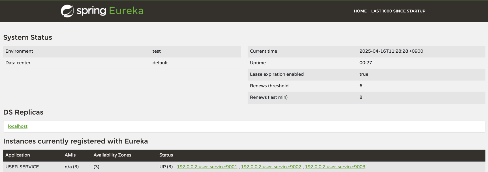

# User Service

### 여러 service 를 띄우는 방법

- config 사용 방법
    - edit configuration 에서 spring boot 를 추가해서 해당 config 를 run
    - applications.yml 에 지정된 port 가 겹치기 때문에 따로 지정 필요
    - VM options 에 `-Dserver.port=9002` 와 같이 port 를 지정해주어야한다.
- maven build 로 직접 띄우는 방법
    - `mvn spring-boot:run -Dspring-boot.run.jvmArguments='-Dserver.port=9003'` 명령어로 가능
- maven build 해서 jar 로 띄우는 방법
    - `mvn clean compile package`
        - `java -jar -Dserver.port=9004 ./~~~~.jar`



- Random Port 사용하는 법
    - `application.yml` 에서 port 0으로 세팅하면 random port 띄워준다.
    - ```yaml
      eureka:
        instance:
          instance-id: ${spring.cloud.client.hostname}:${spring.application.instance_id:${random.value}}
      ```
    - `mvn spring-boot:run` 만 해줘도 자동으로 다른 port 로 띄워진다.